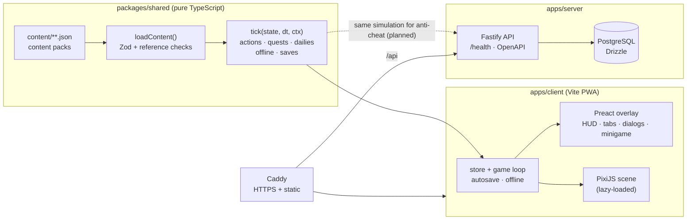

# Spin Doctor – Pressesprecher der Republik Superbia

> A satirical, mobile-first idle game in the browser. You are the freshly hired press secretary of
> the power-hungry (and entirely fictional) President **Magnus Rekord** — and every upgrade you buy
> hollows out the democracy of the Republic of Superbia a little further.

The punchline is the mechanic itself: the game rewards you for exactly the techniques of power it
criticises — distraction, record claims, loyalty tests, media as the enemy, nepotism, loyal judges.
Dry and ironic, in the spirit of *Yes Minister*, *Veep* or the *heute-show*. Game texts are German
first (English translation is on the roadmap).


<!-- TODO: replace with a GIF of the press room -->

## Features (v0.1)

- **Idle core loop:** tap the podium for *Spin*, buy 6 generators (from the intern with a work phone
  to the *Ministry of Truth Care*), 10 upgrades, milestones ×2, offline income (max 8 h).
- **Approval rating** multiplies production; the **democracy index** crumbles with every dark upgrade.
- **Act 1 "Die ersten 100 Tage"** — the onboarding is the story.
- **Quests:** NPC dialog *"Die Brücke ins Nichts"*, the *headline swipe* minigame, the random event
  *"Der Präsident hat gepostet"*, and 3 daily quests with a streak.
- **Lexicon:** factual cards (press freedom, separation of powers, gerrymandering) unlocked by the
  upgrades that attack those institutions.
- **Everything is data:** stats, generators, upgrades, story acts, quests, events and texts are JSON
  content packs — new storylines or new "points" need no engine code ([ADR 0002](docs/adr/0002-data-driven-content.md)).
- Installable **PWA**, works offline, save export/import as text code.

## Roadmap

Next up: a walkable map of the capital with new levels — Rosengarten der Strafzölle, P.R.I.C.E., golf resort, Bear Force One, Jubel-TV, a campaign mode and the finale in the Great Dome. See [docs/roadmap.md](docs/roadmap.md).

## Quickstart

Requirements: Node 24 (`.nvmrc`), pnpm 10 (`corepack enable`).

```bash
pnpm install
pnpm dev            # client on http://localhost:5173 (+ LAN URL for your phone), API on :3000
```

or with Docker (Postgres + API + client with hot reload):

```bash
docker compose up
# ports busy? SERVER_PORT=3100 CLIENT_PORT=5174 DB_PORT=5433 docker compose up
```

Open the LAN URL printed by Vite on your phone (same Wi-Fi). Add `?debug` to the URL for debug buttons
in the settings tab (trigger events, +1 Mio. Spin).

| Command | What |
|---|---|
| `pnpm dev` | client + server in watch mode |
| `pnpm test` | Vitest (simulation, balancing, quest engine, API) |
| `pnpm lint` / `pnpm format` | Biome |
| `pnpm typecheck` | TypeScript strict in all packages |
| `pnpm validate:content` | validates all content packs + German texts |
| `pnpm text:stats` | words and reading time per quest, texts over their word budget |
| `pnpm build` / `pnpm size` | production build / initial-bundle budget (300 kB gzip) |
| `pnpm assets` | regenerates the [asset checklist](docs/ASSET_CHECKLIST.md) |

## Architecture



- The simulation is **pure and deterministic** (seeded RNG in state, time passed in) and knows
  nothing about DOM or Pixi — the server can reuse it for save validation later.
- Architecture decisions: [`docs/adr/`](docs/adr).

## Deployment

`docker-compose.prod.yml` runs Caddy (automatic HTTPS, serves the static client, proxies `/api`),
the API, Postgres with a volume and a nightly backup job. Releases deploy themselves: the
release-please release triggers `.github/workflows/deploy.yml`, which pushes the images to GHCR
and rolls them out over SSH. Setup, rollback and restore: [`docs/DEPLOY.md`](docs/DEPLOY.md).

```bash
cp .env.example .env   # set DOMAIN, ACME_EMAIL, POSTGRES_PASSWORD, DATABASE_URL
docker compose -f docker-compose.prod.yml pull && docker compose -f docker-compose.prod.yml up -d
```

## Contributing

Contributions are very welcome — code, **quests, events, president posts, headlines**, art and sound.
Read [CONTRIBUTING.md](CONTRIBUTING.md) (workflow, commit rules, **satire guardrails**, how to write a
quest) and the [asset guide](docs/ASSET_GUIDE.md).

## License

Code: [MIT](LICENSE). Own graphics, sounds and game texts: [CC BY 4.0](LICENSE-ASSETS).
Third-party assets: see [ASSETS.md](ASSETS.md).

*All characters, parties, media and countries are fictional. Any resemblance to real techniques of
power is intended.*
